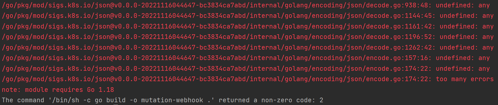
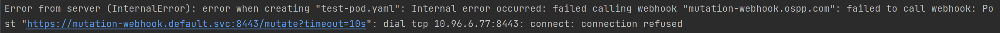

# PreTask of OSPP 2023 Layotto

- [PreTask of OSPP 2023 Layotto](#pretask-of-ospp-2023-layotto)
	- [任务要求](#任务要求)
		- [前置知识](#前置知识)
		- [目标](#目标)
		- [注入数据](#注入数据)
		- [输出](#输出)
		- [提交](#提交)
	- [Kind](#kind)
		- [Kind简介](#kind简介)
		- [在 WSL2 中安装 kind](#在-wsl2-中安装-kind)
		- [使用 Kubectl 与Kind 集群进行交互](#使用-kubectl-与kind-集群进行交互)
	- [Mutation Webhook](#mutation-webhook)
		- [Mutation Webhook 介绍](#mutation-webhook-介绍)
		- [如何实现 Mutation Webhook 的部署？](#如何实现-mutation-webhook-的部署)
	- [方案设计](#方案设计)
		- [编写Mutation Webhook代码](#编写mutation-webhook代码)
				- [第一版代码](#第一版代码)
				- [第二版代码](#第二版代码)
		- [将 Mutation Webhook 打包为 Docker 镜像](#将-mutation-webhook-打包为-docker-镜像)
		- [创建 Kubernetes Secret 对象](#创建-kubernetes-secret-对象)
		- [创建 Deployment 和 Service 对象](#创建-deployment-和-service-对象)
		- [创建 MutatingWebhookConfiguration 对象](#创建-mutatingwebhookconfiguration-对象)
		- [使用 cert-manager 来颁发证书](#使用-cert-manager-来颁发证书)
		- [遇到的问题](#遇到的问题)
			- [问题1](#问题1)
			- [问题2](#问题2)
			- [问题3](#问题3)
			- [问题4](#问题4)
			- [问题5](#问题5)
	- [测试 Mutation Webhook](#测试-mutation-webhook)


## 任务要求

### 前置知识

1. 熟悉 Golang
2. 了解 Kubernetes 相关机制，Pod 相关知识
3. 了解 Webhook 机制

### 目标

使用 Golang 编写一个 mutationwebhook，用于对包含 "ossp":"2023" label 的 pod 动态添加一个 container。

### 注入数据

container 的 定义为：

```go
corev1.Container{
    Name: "injected-container",
    Image: "busybox",
    Command: []string{
        "sh",
        "-c",
        "echo 'Hello from the injected container!' && sleep 3600",
     },
}
```

### 输出

使用 kind 创建一个 k8s 集群，并在集群中部署所编写的 webhook server，并通过
MutatingWebhookConfiguration 注册 webhook server 到 API Server 中。

最后所创建的包含指定 Label 的 Pod，需要动态添加上述 Container，并通过以下命令验证：

```
kubectl logs <pod-name> -c injected-container
```

这个命令应该输出 "Hello from the injected container!"，表明新容器已成功注入到 Pod 中。

### 提交

在 GitHub 中创建⼀个仓库，并 push 代码和相关所学习到的知识总结到此仓库中


## Kind

### Kind简介

Kind（Kubernetes IN Docker）是一个用于在本地环境中部署 Kubernetes 集群的工具。它使用 Docker 容器来模拟 Kubernetes 集群，可以帮助开发人员在本地环境中进行快速、方便的 Kubernetes 开发和测试。

### 在 WSL2 中安装 kind

官网安装教程：https://kind.sigs.k8s.io/docs/user/quick-start/#installation

本地环境：WIN11 + WSL2 + Docker20.10.17 + go1.16.2

在Kind官网上提供了包管理器、二进制文件、源代码、go install多种安装方式，我选择的是二进制文件的安装方式。

在 WSL2 中运行以下命令安装 kind
```bash
# For AMD64 / x86_64
[ $(uname -m) = x86_64 ] && curl -Lo ./kind https://kind.sigs.k8s.io/dl/v0.19.0/kind-linux-amd64
# For ARM64
[ $(uname -m) = aarch64 ] && curl -Lo ./kind https://kind.sigs.k8s.io/dl/v0.19.0/kind-linux-arm64
chmod +x ./kind
sudo mv ./kind /usr/local/bin/kind
```


### 使用 Kubectl 与Kind 集群进行交互

(1) 查看 Kind 集群信息

- kubectl cluster-info --context kind-kind


(2) 查看节点信息

- kubectl get nodes


(3) 查看 kube-system 空间内运行的pod

- kubectl get pods -n kube-system


## Mutation Webhook

### Mutation Webhook 介绍

Mutation Webhook 是 Kubernetes 中的一种 Webhook，用于拦截和修改 Kubernetes 对象的 mutation 操作。当 Kubernetes API Server 收到用户对某个对象的请求时，Mutation Webhook 可以拦截这个请求并对请求进行修改，然后再将修改后的请求发送给 Kubernetes API Server，从而实现对 Kubernetes 对象的动态修改。

Mutation Webhook 可以用于多种场景，比如安全性检查、自动化操作、自定义策略等。通过 Mutation Webhook，用户可以在 Kubernetes 对象被创建或更新时，对其进行自定义的修改操作，从而实现更加灵活和个性化的管理。

需要注意的是，Mutation Webhook 仅能拦截和修改对 Kubernetes 对象的 mutation 操作，而不能拦截对 Kubernetes 对象的查询操作。此外，Mutation Webhook 也需要用户自己实现，并将其部署到 Kubernetes 集群中。

### 如何实现 Mutation Webhook 的部署？

要实现 Mutation Webhook 的部署，需要完成以下步骤：

1. 编写 Mutation Webhook 的代码：Mutation Webhook 可以使用任何编程语言编写，只需要满足 Kubernetes 定义的 Webhook API 规范即可。具体来说，Mutation Webhook 需要实现一个 HTTP 服务，当 Kubernetes API Server 向其发送 mutation 请求时，Mutation Webhook 需要对请求进行处理并返回修改后的请求。可以使用 Kubernetes 提供的 client-go 库来简化开发过程。
2. 创建 Mutation Webhook 的证书和私钥：为了保证安全性，Mutation Webhook 需要使用证书进行身份验证和加密通信。可以使用 Kubernetes 提供的 Certificates API 来生成证书。
3. 部署 Mutation Webhook：Mutation Webhook 可以部署在 Kubernetes 集群内部或外部。如果部署在集群内部，可以将其部署为一个 Deployment，并将其暴露为一个 Service；如果部署在集群外部，可以将其部署为一个普通的 HTTP 服务，并使用 Kubernetes 的 ValidatingWebhookConfiguration 或 MutatingWebhookConfiguration 对象将其注册到 Kubernetes API Server 中。
4. 配置 Kubernetes API Server：为了让 Kubernetes API Server 能够调用 Mutation Webhook，需要在 Kubernetes API Server 的配置文件中添加对 Mutation Webhook 的配置。具体来说，需要在配置文件的 admissionConfiguration 字段中添加对 Mutation Webhook 的调用配置，包括 Mutation Webhook 的 URL、证书和私钥等信息。

总的来说，Mutation Webhook 的部署比较复杂，需要进行证书管理、HTTP 服务开发、Kubernetes API Server 配置等多个方面的工作。


## 方案设计

### 编写Mutation Webhook代码

##### 第一版代码

```go
package main

import (
	"encoding/json"
	"log"
	"net/http"

	"k8s.io/api/admission/v1beta1"
	corev1 "k8s.io/api/core/v1"
)

func main() {
	http.HandleFunc("/mutate", mutateHandler)
	log.Fatal(http.ListenAndServeTLS(":8443", "cert.pem", "key.pem", nil))
}

func mutateHandler(w http.ResponseWriter, r *http.Request) {
	var admissionReviewReq v1beta1.AdmissionReview
	if err := json.NewDecoder(r.Body).Decode(&admissionReviewReq); err != nil {
		http.Error(w, err.Error(), http.StatusBadRequest)
		return
	}

	pod := corev1.Pod{}
	if err := json.Unmarshal(admissionReviewReq.Request.Object.Raw, &pod); err != nil {
		http.Error(w, err.Error(), http.StatusBadRequest)
		return
	}

	annotations := pod.GetAnnotations()
	if annotations == nil {
		annotations = make(map[string]string)
	}

	if annotations["ossp"] == "2023" {
		container := corev1.Container{
			Name:  "injected-container",
			Image: "busybox",
			Command: []string{
				"sh",
				"-c",
				"echo 'Hello from the injected container!' && sleep 3600",
			},
		}
		pod.Spec.Containers = append(pod.Spec.Containers, container)
	}

	patchBytes, err := createPatch(&pod)
	if err != nil {
		http.Error(w, err.Error(), http.StatusInternalServerError)
		return
	}

	admissionReviewResponse := v1beta1.AdmissionReview{
		Response: &v1beta1.AdmissionResponse{
			Allowed: true,
			Patch:   patchBytes,
			PatchType: func() *v1beta1.PatchType {
				pt := v1beta1.PatchTypeJSONPatch
				return &pt
			}(),
		},
	}

	if err := json.NewEncoder(w).Encode(admissionReviewResponse); err != nil {
		http.Error(w, err.Error(), http.StatusInternalServerError)
		return
	}
}

func createPatch(pod *corev1.Pod) ([]byte, error) {
	var patch []patchOperation

	container := corev1.Container{
		Name:  "injected-container",
		Image: "busybox",
		Command: []string{
			"sh",
			"-c",
			"echo 'Hello from the injected container!' && sleep 3600",
		},
	}

	patch = append(patch, patchOperation{
		Op:    "add",
		Path:  "/spec/containers/-",
		Value: container,
	})

	return json.Marshal(patch)
}

type patchOperation struct {
	Op    string      `json:"op"`
	Path  string      `json:"path"`
	Value interface{} `json:"value,omitempty"`
}

```

##### 第二版代码

在第二版代码中，主要对代码进行了重构，将Webhook关键数据结构提取出来。

```go
package main

import (
	"crypto/tls"
	"encoding/json"
	"fmt"
	"log"
	"net/http"

	"k8s.io/api/admission/v1beta1"
	corev1 "k8s.io/api/core/v1"
)

const (
	CertFile = "/etc/webhook/certs/tls.crt"
	KeyFile  = "/etc/webhook/certs/tls.key"
)

// Webhook implements a mutating webhook for automatic container injection.
type Webhook struct {
	certFile string
	keyFile  string
	cert     *tls.Certificate

	server *http.Server
}

func (wh *Webhook) getCert(*tls.ClientHelloInfo) (*tls.Certificate, error) {
	return wh.cert, nil
}

// WebhookParameters configures parameters for the mutation webhook.
type WebhookParameters struct {
	// CertFile is the path to the x509 certificate for https.
	CertFile string

	// KeyFile is the path to the x509 private key matching `CertFile`.
	KeyFile string

	// Port is the webhook port, e.g. typically 443 for https.
	Port int
}

// NewWebhook creates a new instance of a mutating webhook for automatic sidecar injection.
func NewWebhook(p WebhookParameters) (*Webhook, error) {
	pair, err := tls.LoadX509KeyPair(p.CertFile, p.KeyFile)
	if err != nil {
		return nil, err
	}

	wh := &Webhook{
		certFile: p.CertFile,
		keyFile:  p.KeyFile,
		cert:     &pair,
	}

	mux := http.NewServeMux()
	wh.server = &http.Server{
		Addr:      fmt.Sprintf(":%v", p.Port),
		TLSConfig: &tls.Config{GetCertificate: wh.getCert},
	}
	mux.HandleFunc("/mutate", wh.serveMutate)
	wh.server.Handler = mux

	return wh, nil
}

func (wh *Webhook) Run() {
	if err := wh.server.ListenAndServeTLS("", ""); err != nil {
		log.Fatalf("failed to listen and serve webhook server: %v", err)
	}
}

func main() {
	parameters := WebhookParameters{
		CertFile: CertFile,
		KeyFile:  KeyFile,
		Port:     8443,
	}

	wh, err := NewWebhook(parameters)
	if err != nil {
		fmt.Errorf("failed to create mutate webhook: %v", err)
	}

	wh.Run()
}

func (wh *Webhook) serveMutate(w http.ResponseWriter, r *http.Request) {
	var admissionReviewReq v1beta1.AdmissionReview
	if err := json.NewDecoder(r.Body).Decode(&admissionReviewReq); err != nil {
		http.Error(w, err.Error(), http.StatusBadRequest)
		return
	}

	pod := corev1.Pod{}
	if err := json.Unmarshal(admissionReviewReq.Request.Object.Raw, &pod); err != nil {
		http.Error(w, err.Error(), http.StatusBadRequest)
		return
	}

	patchBytes, err := createPatch(&pod)
	if err != nil {
		http.Error(w, err.Error(), http.StatusInternalServerError)
		return
	}

	admissionReviewResponse := v1beta1.AdmissionReview{
		Response: &v1beta1.AdmissionResponse{
			UID:     admissionReviewReq.Request.UID,
			Allowed: true,
			Patch:   patchBytes,
			PatchType: func() *v1beta1.PatchType {
				pt := v1beta1.PatchTypeJSONPatch
				return &pt
			}(),
		},
		TypeMeta: admissionReviewReq.TypeMeta,
	}

	if err := json.NewEncoder(w).Encode(admissionReviewResponse); err != nil {
		http.Error(w, err.Error(), http.StatusInternalServerError)
		return
	}
}

func createPatch(pod *corev1.Pod) ([]byte, error) {
	var patch []patchOperation

	labels := pod.GetLabels()
	if labels != nil {
		if value, ok := labels["ossp"]; ok && value == "2023" {
			container := corev1.Container{
				Name:  "injected-container",
				Image: "busybox",
				Command: []string{
					"sh",
					"-c",
					"echo 'Hello from the injected container!' && sleep 3600",
				},
			}
			pod.Spec.Containers = append(pod.Spec.Containers, container)

			patch = append(patch, patchOperation{
				Op:    "add",
				Path:  "/spec/containers/-",
				Value: container,
			})
		}
	}

	return json.Marshal(patch)
}

type patchOperation struct {
	Op    string      `json:"op"`
	Path  string      `json:"path"`
	Value interface{} `json:"value,omitempty"`
}

```


参考链接：

1. https://kubernetes.io/zh-cn/docs/reference/access-authn-authz/extensible-admission-controllers/#experimenting-with-admission-webhooks

2. https://www.cnblogs.com/luozhiyun/p/13942838.html
3. https://github.com/kubernetes/kubernetes/blob/release-1.21/test/images/agnhost/webhook/main.go


### 将 Mutation Webhook 打包为 Docker 镜像

Dockerfile文件内容如下：

```dockerfile
FROM golang:1.18-alpine AS build-env

# 设置工作目录
WORKDIR /app

# 复制代码到镜像中
COPY . .

# 编译 Mutation Webhook 服务
RUN go build -o mutation-webhook .

# 运行 Mutation Webhook 服务
FROM alpine:latest
RUN apk --no-cache add ca-certificates
WORKDIR /app
COPY --from=build-env /app/mutation-webhook .
EXPOSE 8443
ENTRYPOINT ["./mutation-webhook"]
```

执行命令在 Docker 中构建镜像

```bash
docker build -t mutationwebhook:v1.0 .
```


镜像构建成功


推送镜像到 DockerHub

用户名：wyx20000905

密码：***


```bash
docker login
docker tag mutationwebhook:v1.0 wyx20000905/mutationwebhook:v1.0
docker push wyx20000905/mutationwebhook:v1.0
```


### 创建 Kubernetes Secret 对象

Mutation Webhook 服务必须使用 HTTPS 协议，因此需要为 Mutation Webhook 服务创建证书和私钥。使用 OpenSSL 工具来生成自签名证书和私钥

```bash
openssl req -x509 -nodes -newkey rsa:2048 -keyout webhook.key -out webhook.crt -subj "/CN=mutation-webhook.ospp.com"
```

Mutation Webhook 在与 Kubernetes API Server 通信时需要使用证书和私钥，因此需要创建 Kubernetes Secret 对象来存储这些敏感信息。例如，可以使用以下命令创建一个名为 `mutation-webhook-certs` 的 Secret 对象：

```bash
kubectl create secret tls mutation-webhook-certs --cert=webhook.crt --key=webhook.key
```

其中 `webhook.crt` 和 `webhook.key` 分别是 Mutation Webhook 使用的证书和私钥文件。

查看 secret 信息

```bash
kubectl describe secret mutation-webhook-certs
```


### 创建 Deployment 和 Service 对象

使用 Kubernetes 的 Deployment 和 Service 对象将 Mutation Webhook 服务部署在 Kubernetes 集群外的服务器上。例如，可以使用以下 YAML 文件创建一个名为 `mutation-webhook` 的 Deployment 和 Service 对象：

```yaml
apiVersion: apps/v1
kind: Deployment
metadata:
  name: mutation-webhook
  namespace: default
  labels:
    app: mutation-webhook
spec:
  replicas: 1
  selector:
    matchLabels:
      app: mutation-webhook
  template:
    metadata:
      labels:
        app: mutation-webhook
        webhook: enabled
    spec:
      containers:
        - name: mutation-webhook
          image: mutationwebhook:v1.0
          imagePullPolicy: Always
          ports:
            - name: https
              containerPort: 8443
              protocol: TCP
          volumeMounts:
            - name: webhook-certs
              mountPath: /etc/webhook/certs
              readOnly: true
      volumes:
        - name: webhook-certs
          secret:
            secretName: mutation-webhook-certs
---
apiVersion: v1
kind: Service
metadata:
  name: mutation-webhook
  namespace: default
  labels:
    app: mutation-webhook
spec:
  selector:
    app: mutation-webhook
  ports:
    - name: https
      port: 8443
      targetPort: 8443
      protocol: TCP
```

其中：

- `name` 字段指定了 Deployment 和 Service 的名称；
- `selector` 字段指定了 Deployment 和 Service 所匹配的标签；
- `replicas` 字段指定了 Deployment 的副本数；
- `template` 字段指定了 Deployment 所使用的 Pod 模板；
- `containers` 字段指定了 Pod 中的容器信息；
- `image` 字段指定了容器所使用的 Docker 镜像；
- `ports` 字段指定了容器中监听的端口；
- `env` 字段指定了容器中的环境变量；

将上述 YAML 文件保存为 `mutation-webhook.yaml` 文件，并使用以下命令将其提交到 Kubernetes API Server：

```bash
kubectl apply -f mutation-webhook.yaml
```


### 创建 MutatingWebhookConfiguration 对象

在 Kubernetes 集群中注册 Mutation Webhook 需要创建一个 MutatingWebhookConfiguration 对象，并将其提交到 Kubernetes API Server 中。使用以下 YAML 文件创建一个名为 `mutation-webhook-config` 的 MutatingWebhookConfiguration 对象：

```yaml
apiVersion: admissionregistration.k8s.io/v1
kind: MutatingWebhookConfiguration
metadata:
  name: mutation-webhook-cfg
webhooks:
  - name: mutation-webhook.ospp.com
    clientConfig:
      service:
        name: mutation-webhook
        namespace: default
        path: "/mutate"
        port: 8443
      caBundle: <base64-encoded-ca-bundle>
    sideEffects: None
    admissionReviewVersions: [ "v1", "v1beta1" ]
    rules:
      - apiGroups:
          - ""
        apiVersions:
          - v1
        operations:
          - CREATE
        resources:
          - pods
```

其中：

- `name` 字段指定了 MutatingWebhookConfiguration 的名称；
- `webhooks` 字段是一个数组，包含了 Mutation Webhook 的配置信息；
- `name` 字段指定了 Mutation Webhook 的名称；
- `clientConfig` 字段指定了 Mutation Webhook 的连接信息，包括服务名、命名空间、路径和 CA 证书；
- `caBundle` 字段是一个 Base64 编码的 CA 证书，可以使用以下命令获取：

```bash
cat webhook.crt | base64 --wrap=0
```

- `rules` 字段指定了 Mutation Webhook 作用的资源和操作；

使用以下命令将其提交到 Kubernetes API Server：

```bash
kubectl apply -f mutation-webhook-config.yaml
```


### 使用 cert-manager 来颁发证书

分别执行如下命令来实现使用 cert-manager 来颁发证书：

```bash
kubectl apply -f https://github.com/cert-manager/cert-manager/releases/download/v1.11.0/cert-manager.yaml

kubectl apply -f issuer.yaml

kubectl apply -f cert.yaml

kubectl apply -f mutation-webhook-config.yaml
```

`issuer.yaml`

```yaml
apiVersion: cert-manager.io/v1
kind: Issuer
metadata:
  name: selfsigned-issuer
  namespace: default
spec:
  selfSigned: {}
```

`cert.yaml`

```yaml
apiVersion: cert-manager.io/v1
kind: Certificate
metadata:
  name: mutation-webhook-certs
  namespace: default
spec:
  dnsNames:
  - mutation-webhook.default.svc
  issuerRef:
    kind: Issuer
    name: selfsigned-issuer
  secretName: mutation-webhook-certs
```

`mutation-webhook-config.yaml`

```yaml
apiVersion: admissionregistration.k8s.io/v1
kind: MutatingWebhookConfiguration
metadata:
  annotations:
    cert-manager.io/inject-ca-from: default/mutation-webhook-certs
  name: mutation-webhook-config
webhooks:
  - name: mutation-webhook.ospp.com
    clientConfig:
      service:
        name: mutation-webhook
        namespace: default
        path: "/mutate"
        port: 443
    sideEffects: None
    admissionReviewVersions: [ "v1", "v1beta1" ]
    rules:
      - apiGroups:
          - ""
        apiVersions:
          - v1
        operations:
          - CREATE
        resources:
          - pods
```

其中 `cert-manager.io/inject-ca-from: default/mutation-webhook-certs` 表示将使用 **namespace** default下的 **secret** mutation-webhook-certs 的 ca 填充到caBundle中。

验证结果：

```bash
kubectl desribe MutatingWebhookConfiguration mutation-webhook-config
```


可以看到 caBundle 已经被填充进去了！


参考链接

- https://juejin.cn/post/6888220331169972237

- https://github.com/cert-manager/cert-manager
- https://cert-manager.io/docs/configuration/selfsigned/


### 遇到的问题

#### 问题1


这个错误是由于 `sigs.k8s.io/json` 模块的最新版本中添加了 `//go:build` 标记，而使用的 Go 版本可能不支持该标记导致的。为了解决该问题，我查询到有两种方案：(1) 尝试降低 `sigs.k8s.io/json` 模块的版本 (2) 升级 Go 版本到支持 `//go:build` 标记的版本。

我选择的是修改 Dockerfile 中的基础镜像为 `FROM golang:1.17-alpine`



尝试修改 Dockerfile 中的基础镜像为 `FROM golang:1.18-alpine`

成功打包镜像。

#### 问题2


该错误消息提示需要在 MutatingWebhookConfiguration 对象的 `webhooks` 字段中设置 `sideEffects` 和 `admissionReviewVersions` 字段。这两个字段是 Kubernetes 1.16 版本引入的新字段，用于控制 MutatingWebhook 和 ValidatingWebhook 的行为和 API 版本。

`sideEffects` 字段用于指定 MutatingWebhook 或 ValidatingWebhook 是否会引入副作用。副作用指的是在执行 MutatingWebhook 或 ValidatingWebhook 时，是否会对 Kubernetes 对象进行修改或删除操作。如果 Webhook 不会引入副作用，则应将 `sideEffects` 字段设置为 `None` 或 `NoneOnDryRun`。如果 Webhook 可能会引入副作用，则应将 `sideEffects` 字段设置为 `Unknown` 或 `Some`。

`admissionReviewVersions` 字段用于指定支持的 AdmissionReview 版本。AdmissionReview 是 Kubernetes API 中用于 Webhook 的数据结构，用于传递 Kubernetes 对象以及 MutatingWebhook 和 ValidatingWebhook 的响应。如果 Webhook 支持 Kubernetes 1.16 及以上版本，则应将 `admissionReviewVersions` 字段设置为 `v1` 或 `v1beta1`。

解决方法：在YAML文件中添加 sideEffects 以及 admissionReviewVersions字段

```yaml
sideEffects: None
admissionReviewVersions: ["v1", "v1beta1"]
```

#### 问题3



（1）检查服务是否已经正确部署，并且在端口 `8443` 上监听。使用以下命令检查服务是否已经正确部署：

```bash
kubectl get svc mutation-webhook
```

该命令应该返回一个名为 `mutation-webhook` 的服务，并且该服务应该具有一个或多个端口。如果服务不存在或没有端口，则可能需要重新部署服务或检查服务定义文件中的错误。

（2）检查 MutatingWebhookConfiguration 对象的定义文件，以确保它正确地引用了服务和端口。

这个配置文件的 `clientConfig.service.name` 字段应该与服务的名称完全匹配，并且 `clientConfig.service.port` 应该与服务的端口号完全匹配。

（3）检查服务的日志，以查看是否有任何与连接相关的错误。使用以下命令获取服务的 Pod 名称，然后使用 `kubectl logs` 命令查看其日志：

```bash
kubectl get pods -l app=mutation-webhook -o name
kubectl logs <pod-name> -c mutation-webhook
```

如果服务正在运行但仍无法连接，则可能需要检查服务配置文件中的错误，或者检查与服务相关的防火墙规则是否正确配置。


原来是 image 字段填写错误，在DockerHub上传镜像后成功解决问题。

#### 问题4


解决方法：在生成证书时确保证书的 Common Name (CN) 字段或者 Subject Alternative Name (SAN) 字段与webhook 服务的 DNS 名称匹配。

```bash
openssl req -x509 -nodes -newkey rsa:2048 -keyout webhook.key -out webhook.crt -subj "/CN=mutation-webhook.default.svc"

cat webhook.crt | base64 -w0
cat webhook.key | base64 -w0
```

#### 问题5


要解决 "x509: certificate relies on legacy Common Name field, use SANs instead" 这个错误，需要重新生成证书，使用 Subject Alternative Names (SANs) 字段来指定证书的 DNS 名称，而不是使用 Common Name (CN) 字段。

```bash
openssl req -x509 -nodes -newkey rsa:2048 \
    -keyout webhook.key -out webhook.crt \
    -subj "/CN=mutation-webhook.default.svc" \
    -reqexts SAN -extensions SAN \
    -config <(cat /etc/ssl/openssl.cnf \
        <(printf "[SAN]\nsubjectAltName=DNS:mutation-webhook.default.svc"))
```


## 测试 Mutation Webhook

现在，Mutation Webhook 已经部署完成。创建一个 Pod 并添加 "ossp":"2023" label 以测试 Mutation Webhook 是否能够正常工作。使用以下 YAML 文件创建一个名为 `test-pod` 的 Pod：

```yaml
apiVersion: v1
kind: Pod
metadata:
  name: test-pod
  labels:
    ossp: "2023"
spec:
  containers:
    - name: nginx
      image: nginx
      ports:
        - containerPort: 80
```

将上述 YAML 文件保存为 `test-pod.yaml` 文件，并使用以下命令将其提交到 Kubernetes API Server：

```bash
kubectl apply -f test-pod.yaml
```

查看创建的 Pod 是否已经成功注入了一个名为 "injected-container" 的容器：

```bash
kubectl describe pod test-pod
```

查看 "injected-container" 的容器输出日志：

```
kubectl logs test-pod -c injected-container
```


完结撒花！


